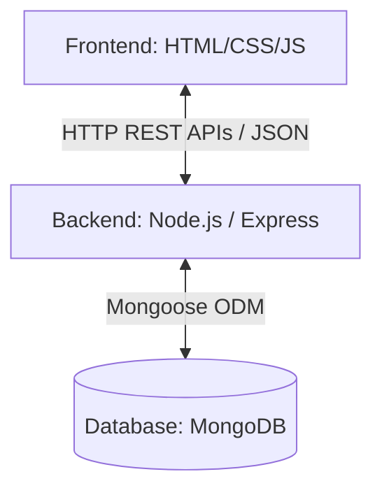

# MongoDB & Backend Integration Plan

This document outlines the proposal and implementation checklist to transition **QuizYou** from a client-side prototype (using local static files and localStorage) into a full-stack web application with a MongoDB database.

---

## 1. System Architecture Diagram



* **Current Architecture**: The application runs entirely in the browser. It fetches `students.json` and `questions.json` and preserves history locally in `localStorage`.
* **Proposed Architecture**: The client communicates with a central REST API. Users, questions, and attempt history are persisted securely in MongoDB.

---

## 2. Database Schema Proposals

We will use MongoDB collections structured via Mongoose.

### 2.1. Users Collection
Holds students and admins/professors credentials. Passwords must be hashed using `bcrypt` before storage.

```javascript
const userSchema = new mongoose.Schema({
  id: { 
    type: String, 
    required: true, 
    unique: true 
  }, // e.g. "abhikoka", "dbacon89"
  firstName: { type: String, required: true },
  lastName: { type: String, required: true },
  email: { type: String, required: true, unique: true },
  password: { type: String, required: true }, // Hashed
  role: { 
    type: String, 
    enum: ['student', 'professor'], 
    default: 'student' 
  }
});
```

### 2.2. Questions Collection
Contains the quiz banks grouped by subject labels.

```javascript
const questionSchema = new mongoose.Schema({
  subject: { 
    type: String, 
    required: true // e.g., "Testing", "Agile", "Design Patterns", "Git"
  },
  question: { type: String, required: true },
  options: { 
    type: [String], 
    required: true // Array: ["Choice A", "Choice B", "Choice C", "Choice D"]
  },
  correctAnswer: { 
    type: Number, 
    required: true // 0-indexed index of correct choice
  },
  createdBy: { 
    type: mongoose.Schema.Types.ObjectId, 
    ref: 'User' // Reference to the professor who created it
  },
  createdAt: { type: Date, default: Date.now }
});
```

### 2.3. Exam Results Collection
Records student scorecard histories.

```javascript
const examResultSchema = new mongoose.Schema({
  student: { 
    type: mongoose.Schema.Types.ObjectId, 
    ref: 'User', 
    required: true 
  },
  subject: { type: String, required: true },
  score: { type: String, required: true }, // e.g. "8/10"
  percentage: { type: Number, required: true }, // e.g. 80
  timeTaken: { type: String, required: true }, // e.g. "02:14"
  date: { type: Date, default: Date.now }
});
```

---

## 3. API Specification

| Endpoint | Method | Authentication | Description |
| :--- | :--- | :--- | :--- |
| `/api/auth/login` | `POST` | Public | Validates student credentials and returns a Session Token (JWT). |
| `/api/questions` | `GET` | Student / Professor | Fetches a filtered list of questions based on configuration parameters (`subject`, `limit`). |
| `/api/results` | `POST` | Student | Saves a completed quiz result. |
| `/api/results/:studentId` | `GET` | Student / Professor | Retrieves past attempts for the dashboard panel. |
| `/api/admin/questions` | `POST` | Professor | Inserts a new single question. |
| `/api/admin/questions/bulk`| `POST` | Professor | Takes a JSON list of questions and bulk inserts them. |

---

## 4. Question Upload Workflow (For Professors)

We propose two administrative methods for professors to add content:

### Option A: Bulk JSON Upload
Professors import questions directly in a file upload field.

1. **Dashboard UI Interface**: Add an administrative upload panel.
2. **File Processing**: The frontend parses the chosen `.json` file and does schema checking.
3. **Save Operation**: The backend triggers a batch insert `insertMany` in MongoDB.

### Option B: Form-based Creation UI
A visual builder interface allowing professors to input a question manually.

```
+-------------------------------------------------------------+
|                     ADD NEW QUESTION                        |
|                                                             |
| Subject:       [ Design Patterns \v]                        |
| Question Text: [ What is the purpose of Adapter pattern?  ] |
|                                                             |
| Option A:      [ Convert interface of a class to another  ] |
| Option B:      [ Wrap a single instance                   ] |
| Option C:      [ Define family of algorithms              ] |
| Option D:      [ Separate abstraction from implementation ] |
|                                                             |
| Correct Ans:   (o) Option A   ( ) Option B                  |
|                ( ) Option C   ( ) Option D                  |
|                                                             |
|                       [ Save Question ]                     |
+-------------------------------------------------------------+
```

---

## 5. Migration Roadmap / Actions

1. **Setup Server**: Initialise `npm init -y` inside a new `/server` directory and install packages: `express`, `mongoose`, `dotenv`, `cors`, `bcryptjs`, and `jsonwebtoken`.
2. **Setup Database**: Provision a MongoDB database (e.g. MongoDB Atlas cluster).
3. **Database Seed**: Write a migration script that reads the existing [students.json](file:///Users/abhikoka/Library/CloudStorage/OneDrive-Personal/Documents/BU_SE/QuizYou/students.json) and [questions.json](file:///Users/abhikoka/Library/CloudStorage/OneDrive-Personal/Documents/BU_SE/QuizYou/questions.json) and imports them into MongoDB collections.
4. **Transition Frontend**: Replace local file fetches and `localStorage` saves in [app.js](file:///Users/abhikoka/Library/CloudStorage/OneDrive-Personal/Documents/BU_SE/QuizYou/app.js) with AJAX `fetch` calls to backend API routes.
